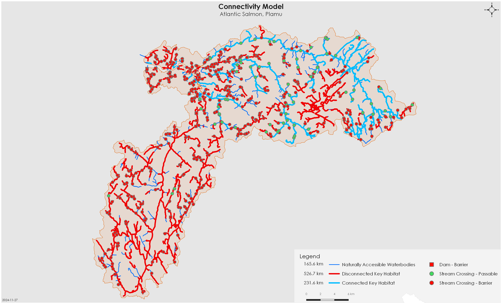
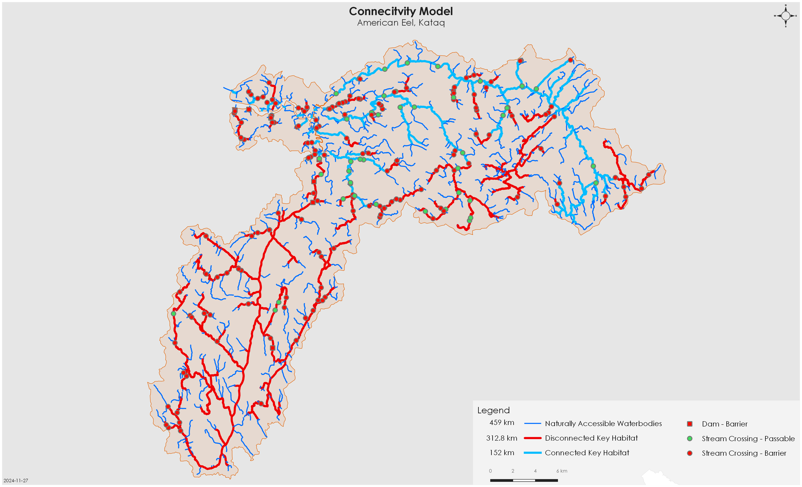

::: {.cell}

:::

::: {.cell}

:::

# Connectivity Status Assessment {-}

## Connectivity Status Assessment {-}

The current connectivity status for each species was estimated using three spatial models: 

1. **Accessibility model:** Naturally accessible waterbodies are those that are considered likely accessible to focal species if no human-made barriers existed on the landscape. These were spatially delineated for each focal species using natural barriers (i.e., waterfalls, gradient barriers, or subsurface flows) that would limit upstream movement (@tbl-spn). 

2. **Habitat model:** A subset of the naturally accessible waterbody layer was defined as key habitat based on the KEA. The habitat model identifies waterbodies that have a higher potential to support key habitat based on stream characteristics like channel gradient and discharge. The habitat model criteria can be found in (@tbl-spn).  

3. **Connectivity model:** A layer of known or modelled structures was overlaid on the key habitat results. Structures with unknown passability were treated as a full barrier until confirmed passable (100% passable) or partially passable (25, 50, or 75%) by either local knowledge, desktop review, or field assessment. Watershed connectivity was estimated by calculating the amount of key habitat that is connected to the ocean (i.e., not fragmented by human-made barriers). Key habitat with only passable structures downstream was considered fully connected. All key habitat with any full barrier downstream was considered disconnected.  

All connected habitats were summed and divided by the total amount of key habitat in the watershed to determine the proportion of connected habitat relative to the entire watershed. Of the estimated 758 km of key spawning and rearing habitat for Plamu in the Maqmekwitk watershed, 30.54% (231.6 km) is connected to the ocean (@fig-4). Similarly, of the 464.9 km of key eel habitat (used for feeding and growth) in the Maqmekwitk watershed, 32.71% (152 km) is connected to the ocean (@fig-5). These values are likely an underestimate of how connected the system, and additional field assessments and local knowledge exchange to confirm species-specific passability for potential barriers will help to close those knowledge gaps and ensure a more accurate estimate of connectivity status.  

{#fig-4}

{#fig-5}
