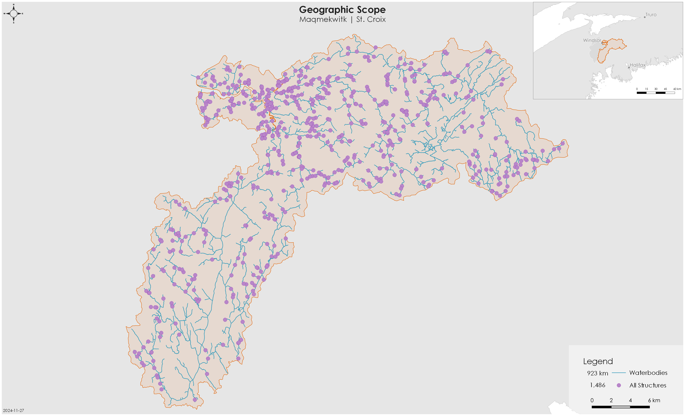
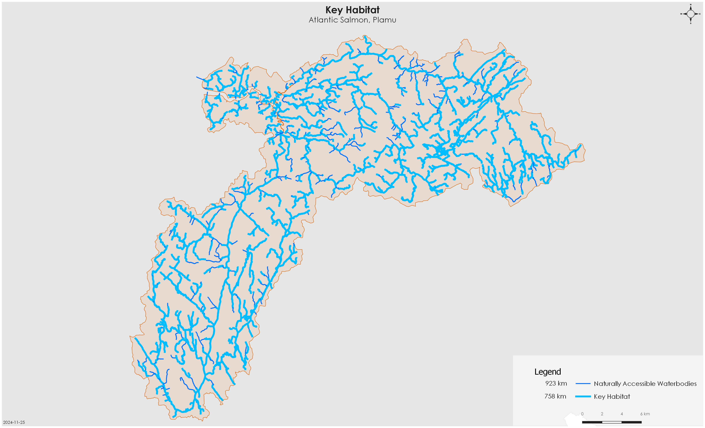
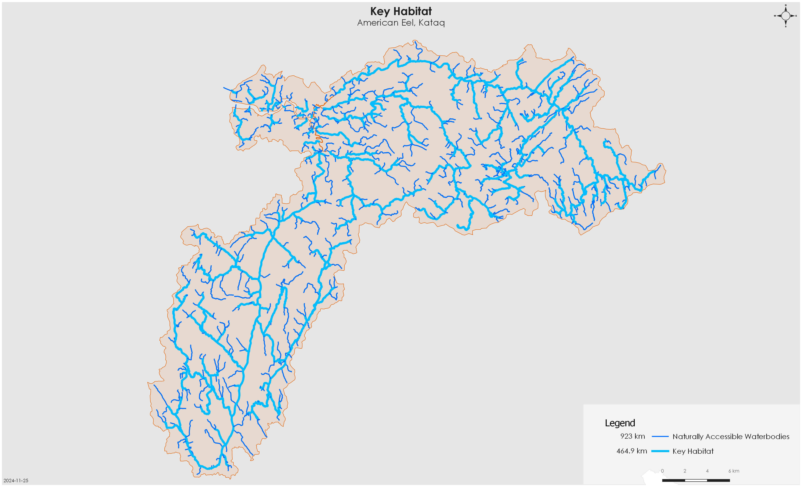

::: {.cell}

:::


# Project Overview {-} 

## Plan Purpose, Approach, and Scope {-}

The following Reconnecting our Rivers project represents the culmination of a collaborative planning effort with the Confederacy of Mainland Mi’kmaq (CMM) and the Canadian Wildlife Federation (CWF). The overall aim is to build meaningful partnerships, reduce the threat of aquatic barriers to diadromous fish and the livelihoods that they support. This plan will identify priority actions that CMM, CWF, and other project partners propose to undertake between 2023-2033 to preserve and restore fish connectively in the Maqmekwitk (St. Croix) watershed, with additional watersheds being added in future years (including Shubenacadie and Stewiacke River). This will be done through addressing physical barriers to fish passage. This watershed connectivity plan will be shared with local First Nations, Fisheries and Oceans Canada (DFO), the NS Government, NGOs, and local stakeholders to inform directed efforts to improve fish productivity and diversity in these watersheds.  

## Vision Statement {-}

Healthy, well-connected rivers within the Maqmekwitk watershed support populations of migratory fish including Plamu (Atlantic Salmon) and Kataq (American Eel), improving the overall ecosystem health of the watershed. In turn, these fish provide the continued food, social, and ceremonial (FSC) needs of the Mi'kmaw people, as they have since time immemorial. Both residents and visitors to the watershed will work together, guided by the principles of Etuaptmumk (two-eyed seeing), to mitigate the negative effects of anthropogenic aquatic barriers, improving the resiliency of the watershed for the benefit and appreciation of all. 

## Project Scope {-}

Connectivity is a critical component of freshwater ecosystems that encompasses a variety of factors related to ecosystem structure and function, such as the ability of aquatic organisms to disperse and/or migrate, the transportation of energy and matter (e.g., nutrient cycling and sediment flows), and temperature regulation (@Seliger2018-be). Though each of these factors are important when considering the health of a watershed, for the purpose of this project the term "connectivity" is defined as the degree to which aquatic organisms can disperse and/or migrate freely through freshwater systems. Within this context, connectivity is primarily constrained by physical barriers, including anthropogenic infrastructure such as dams and stream crossings, and natural features such as waterfalls. This plan will focus on the direct rehabilitation and prevention of localized, physical barriers instead of the broad, land-use patterns causing chronic connectivity issues in the watershed. The planning team decided that the primary focus of this watershed connectivity plan is addressing barriers to longitudinal connectivity (i.e., along the upstream-downstream plane) due to the importance of maintaining fish passage to spawning and rearing habitat in the watershed. 

## Focal species

Focal species represent the ecologically and culturally important species for which habitat connectivity is being directly conserved and/or restored in the watershed. The planning team selected three target species: Plamu (Atlantic Salmon) and Kataq (American Eel). The selection of these key species was driven primarily by local conservation goals. 

### Atlantic Salmon | Plamu | *Salmo salar* 

Atlantic Salmon are anadromous fishes, meaning mature adults spawn in freshwater and juveniles rear in freshwater before undergoing a process called smoltification where they migrate out to the ocean for 1-3+ years before returning to the freshwater to repeat this process. Due to this migratory process, salmon require unimpeded access between the ocean and freshwater habitats to complete their life cycle.  

Atlantic Salmon spawn in the pool-riffle transition zones of the main stem and larger tributaries of a river (@deGaudemar2000; @Finstad2010). Within these stretches, they seek out the tails of pools, where substrate size allows for females to excavate a space to deposit the eggs to incubate below gravel beds. Fast flowing, well oxygenated water with minimal fine sediments helps to maximize successful embryo development. Atlantic Salmon juveniles (fry and parr) rear in habitat that is deeper and slower, to facilitate their weaker swimming and predation capabilities. Water depth, velocity, and substrate size tend to increase with parr as they increase in size and age. Shelter, in the form of large rocks, boulders, or overhead cover provide crucial refuge for overwintering habitat. Channel gradients most typically associated with these preferred spawning and rearing habitats range from 0.12 to 25%; with highest concentrations below 3% (@Amiro1993).

Salmon in the St. Croix watershed are a part of the Inner Bay of Fundy population that was last assessed by Committee on the Status of Endangered Wildlife in Canada (COSEWIC) as Endangered in 2010 (@Cosewic2010) and has been listed on the Schedule 1 of the Species at Risk Act since 2003.  

### American Eel | Kataq | *Anguilla rostrata* 

American Eel are catadromous species, meaning they spawn in the Sargasso Sea and drift with the ocean currents towards the continental shelf as glass eels. Elvers then continue migrating towards freshwater tributaries to feed and mature, although some populations have been known to stay in the estuaries and bays or move between freshwater and estuary habitat over their life cycle. Their ability to tolerate a wide variety of salinities and temperature thresholds allows them to occupy a variety of habitat types.  

American Eel are widely distributed throughout Nova Scotia rivers, including the St. Croix, and occupy freshwater habitat and estuary habitat for feeding (on small fish, mollusks, insects, and crustaceans) and growth. American Eel were assessed as Threatened by COSEWIC in 2012 (@Cosewic2012). 

## Geographic Scope

The primary geographic scope of this watershed connectivity plan is the Maqmekwitk (St. Croix), which is the larger branch of the Amaqapskiket (Avon River) and drains into the Minas Basin, Bay of Fundy, NS. There are three main branches of the Maqmekwitk, the branch that passes through Panuk, the Herbert River, and the Miluamkitk (Meander River). The Maqmekwitk has a total drainage area of 746.7 km2 (@fig-geoscope). 

{#fig-geoscope}

The geographic scope of this project was further refined by identifying naturally accessible waterbodies, which are defined as streams, lakes, or reservoirs that target species would access in the absence of anthropogenic barriers (@fig-2). Naturally accessible waterbodies were spatially delineated using stream characteristics that define the upper limit of their movement based on species-specific swimming abilities (@tbl-spn). While waterfalls >5m were used as the upper limit for Atlantic Salmon accessibility, our ability to comprehensively model this was limited by incomplete height data for all waterfalls. Future iterations of this project will include field assessment and compilation of local knowledge of waterfall height to further define these boundaries. The spatial extent of the naturally accessible waterbodies layer was then refined based on existing fish observation data and/or redd surveys (for Atlantic Salmon). These maps were explored by the planning team to incorporate additional local knowledge, ensure accuracy, and finalize the criteria used to define naturally accessible waterbodies. The new geographic scope formed the foundation for all subsequent analyses and planning steps. 


::: {#tbl-spn .cell tbl-cap='Species-specific stream characteristics used to spatially delineate naturally accessible waterbodies and key habitat for Atlantic Salmon and American Eel.'}
::: {.cell-output-display}


```{=html}
<style type="text/css">
#T_139b9 th {
  background-color: #008270;
  text-align: left;
}
#T_139b9_row0_col0, #T_139b9_row0_col1, #T_139b9_row0_col2, #T_139b9_row1_col0, #T_139b9_row1_col1, #T_139b9_row1_col2 {
  background-color: white;
  text-align: left;
}
</style>
<table id="T_139b9">
  <thead>
    <tr>
      <th id="T_139b9_level0_col0" class="col_heading level0 col0" >Species</th>
      <th id="T_139b9_level0_col1" class="col_heading level0 col1" >Accessibility Parameters</th>
      <th id="T_139b9_level0_col2" class="col_heading level0 col2" >Key Habitat Parameters</th>
    </tr>
  </thead>
  <tbody>
    <tr>
      <td id="T_139b9_row0_col0" class="data row0 col0" >Plamu, Atlantic Salmon </td>
      <td id="T_139b9_row0_col1" class="data row0 col1" >Channel gradient <30%; waterfalls <5m </td>
      <td id="T_139b9_row0_col2" class="data row0 col2" >Channel gradient <3% </td>
    </tr>
    <tr>
      <td id="T_139b9_row1_col0" class="data row1 col0" >Kataq, American Eel </td>
      <td id="T_139b9_row1_col1" class="data row1 col1" >All stream segments </td>
      <td id="T_139b9_row1_col2" class="data row1 col2" >Strahler order 2+ </td>
    </tr>
  </tbody>
</table>

```


:::
:::


{#fig-2}

{#fig-3}

## Structure Types {-}

The following section highlights three main anthropogenic structure types (aboiteaux, dams, and stream crossings) that fragment key habitat for Plamu and Kataq in the Maqmekwitk watershed.  . 

### Aboiteaux {-}

There are three modelled aboiteaux in the Maqmekwitk, each located close to the mouth of the Minas Basin. There may be more aboiteaux identified currently as stream crossings, but these will require further knowledge exchange, data review and field assessments to confirm. One aboiteau is a confirmed barrier but is low priority due to the low-quality upstream habitat and difficulty in addressing this barrier type.  

### Dams {-}

There are seven mapped dams that potentially block a combined 154 km of linear salmon and eel habitat in the Maqmekwitk. One smaller dam is located downstream of Fundy Gypsum Mine Yard, one is unknown and requires a field assessment, and five generate hydroelectricity. A set of three hydroelectric dams owned and operated by Minas Energy block the largest proportion of salmon habitat (39%; ~119km of linear habitat) amongst all modelled structure types in the Maqmekwitk watershed. 

### Stream Crossings {-}

Stream crossings (i.e., culverts) are the most abundant barrier type in the watershed, with 485 stream crossings located downstream of modelled key habitat for Plamu or Kataq. Stream crossings fully or partially block 385 km of salmon and eel habitat. Detailed assessments by CMM were previously completed on 82 stream crossings located downstream of salmon and eel key habitat. Of these 82 structures, nine were in the top 30 ranked sets. 
