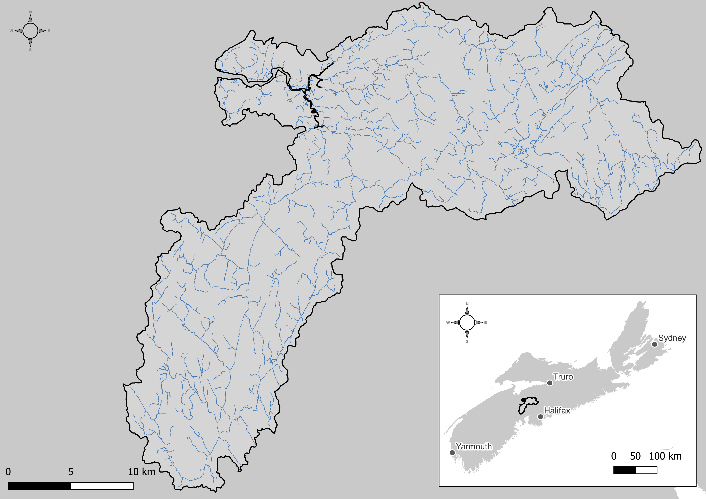

```{python echo=FALSE}
import python.api_calls as api
from ipywidgets import *
import pandas as pd
import warnings

warnings.filterwarnings('ignore')
```

```{r setup, include=FALSE}
#| echo: false
#| warning: false

library(reticulate)
api <- import("python.api_calls")
gain <- api$gain
num_dam <- api$num_dam
km_dam <- api$km_dam
pct_dam <- api$pct_dam
resource_km <- api$resource_km
resource_pct <- api$resource_pct
demo_km <- api$demo_km
demo_pct <- api$demo_pct
resource_sev <- api$resource_sev
demo_sev <- api$demo_sev
sum_road <- api$sum_road

```

# Introduction {-}

## Purpose{-}

The purpose of the Maqmekwitk Watershed Connectivity Restoration Plan (WCRP) is to improve understanding of habitat connectivity for Plamu and Kataq in the Maqmekwitk (St. Croix) watershed and inform efforts to close knowledge gaps and plan and prioritize field assessments and restoration.

Local data and knowledge are combined with connectivity modelling to estimate current connectivity status and identify structures that potentially block the most habitat. This informs the prioritization of field assessments to close the most significant knowledge gaps efficiently. Information from field assessments of barrier status and habitat condition are incorporated into the model, improving understanding of which barriers block the most habitat.

This information is also used to inform and plan restoration efforts. Structure rankings inform restoration prioritization by summarizing what is known about fragmentation and showing the relative amount of habitat upstream of each barrier. Actual prioritization of restoration activities is a social decision that requires additional information, including the quality and condition of upstream habitat, the cultural importance of different areas within the watershed, and the costs and logistics of addressing each barrier relative to the ecological benefits of doing so. 

As knowledge gaps are closed and barriers are addressed, this plan is revised to summarize progress and provide updated estimates of connectivity status and the status and relative importance of remaining structures. 

## Vision Statement {-}

The vision for this WCRP is to have healthy, well-connected rivers within the Maqmekwitk watershed that support populations of migratory fish including Plamu and Kataq, improving the overall ecosystem health of the watershed. In turn, these fish provide the continued food, social, and ceremonial (FSC) needs of the Mi’kmaw people, as they have since time immemorial. Both residents and visitors to the watershed will work together, guided by the principles of Etuaptmumk (two-eyed seeing), to mitigate the negative effects of human-made barriers, improving the resiliency of the watershed for the benefit and appreciation of all.

## Scope {-}

This WCRP focuses on habitat connectivity for Plamu and Kataq in the Maqmekwitk watershed (Figure 5). The Maqmekwitk (St. Croix), is the larger branch of the Amaqapskiket (Avon River) and drains into the Minas Basin, Bay of Fundy, NS. There are three main branches of the Maqmekwitk, the branch that passes through Panuk, the Herbert River, and the Miluamkitk (Meander River). 

Model outputs include an estimate of the current connectivity status along with structure ranks and counts. A connectivity model was developed for each species separately. For Plamu, we modelled the connectivity status of spawning and rearing habitat. Channel gradients most typically associated with these preferred spawning and rearing habitats range from 0.12 to 25%; with highest concentrations below 3% (Amiro 1993). For Kataq, we modelled the connectivity status of all 2+ order stream segments, to capture high-value habitat used for growth and feeding. 

Connectivity models in this WCRP focus on longitudinal habitat fragmentation by anthropogenic structures, including all types of dams, stream crossings, and aboiteaux. Diffuse natural barriers that make entire areas impassible are not included in the models but may be used to define the scope of this WCRP. For example, a tributary that is inhospitable because of increased water temperature may be excluded from the overall spatial scope of the WCRP because restoration needs there are broader than connectivity.

{fig-cap-location="top"}


